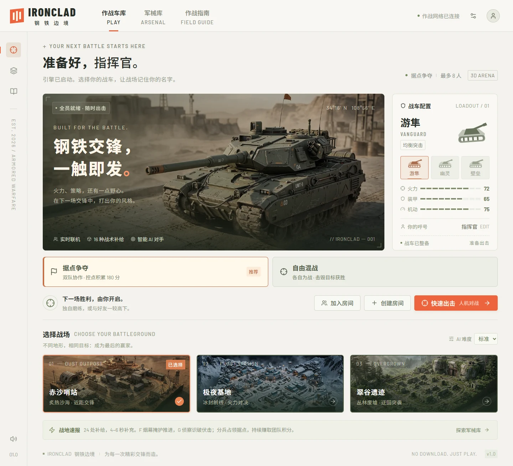

# IRONCLAD · 钢铁边境

精致沙漠工业风的浏览器 3D 坦克竞技游戏。支持房间码联机、双队据点争夺与自由混战、三种战车、三张战场和十六种战术补给。



## 开始游戏

需要 Node.js 22 或更新版本。

```sh
npm ci
npm run dev
```

打开 **http://localhost:5173**。点击「快速出击」即可与 3 名电脑进入双队据点争夺；车库可切换自由混战。

### 和朋友联机

1. 所有人打开**同一个游戏服务的网址**。
2. 一人点击「创建房间」，房间码固定为 **12345**。
3. 好友点击「加入房间」，窗口已默认填入 **12345**。
4. 房主可添加 / 移除电脑，调整模式、地图、电脑难度、混战击毁目标和时长，点击「开始对战」。

最多 8 名玩家（真人与 AI 合计）。局域网中，好友访问 `http://<运行游戏的电脑的局域网 IP>:5173`。电脑防火墙需要允许所使用的端口。各自打开自己电脑的 `localhost` 会连接到不同服务，无法进入同一房间。

每个游戏服务同时保留一个固定编号房间。重复创建不会覆盖已有房间；全部真人离开后，房间会回收，下次创建仍使用 `12345`。快速人机对战也使用此编号。

公网联机需要将生产版本部署到可公开访问的 Node.js 主机，配置 HTTPS 与 WebSocket 转发。这个仓库包含完整服务端，**不依赖付费游戏服务、数据库或 Google API 来运行游戏**。

## 操作与规则

| 操作     | 键位                                   |
| -------- | -------------------------------------- |
| 移动     | WASD / 方向键                          |
| 瞄准     | 鼠标                                   |
| 开火     | 鼠标左键自由射击；按住空格辅助锁定射击 |
| 辅助瞄准 | Q 开关，也可点击战斗界面按钮；默认开启 |
| 冲刺     | Shift / 鼠标右键，4 秒冷却             |
| 放置地雷 | E，0.8 秒引信，最多携带 3 枚           |
| 烟幕掩护 | F，持续 5 秒，12 秒冷却                |
| 战场侦察 | G，持续 4 秒，15 秒冷却，同队共享      |
| 排行榜   | 按住 Tab                               |
| 战场菜单 | Esc（联机比赛继续运行）                |

手机和平板提供移动 / 瞄准射击双摇杆，以及冲刺、地雷、烟幕和侦察按钮。横屏视野更开阔。

可以只用 **WASD + 空格** 移动和射击。辅助瞄准会选择射程内、无掩体遮挡的可攻击敌人；鼠标左键始终使用自由瞄准。鼠标瞄准会随战车与镜头移动持续更新。触屏摇杆增加中心死区，切换窗口或打开菜单时立即发送停止输入。

默认 3 分钟的**据点争夺**：自动平衡两队，同队免伤。在 A / B / C 圈内停留 3 秒占领，敌方点需先中立化；多人加快占领，敌我同圈停止占领和得分。每个控制点每秒贡献 1 分，先到 180 分获胜；时间到比较团队得分，平分为平局。电脑会分兵夺点、防守和寻找维修。

**烟幕与侦察**：F 在身边展开 4.5 米烟幕，遮蔽敌方常规观察、辅助锁定与电脑瞄准，炮弹仍可穿过。G 在 18 米范围内识破烟幕，同队共享效果。接近至 2.5 米或开火后 0.8 秒也会暴露。

自由混战默认 12 次击毁获胜，时间结束按击毁数、较少阵亡排序；完全相同则平局。两种模式均在被击毁后 3 秒复活，出生保护持续 2.5 秒。

- **战车**：游隼（均衡）、幽灵（高机动）、壁垒（重装）。
- **地图**：赤沙哨站、极夜基地、翠谷遗迹，各有独立布局与环境。
- **武器补给**：三连散射、速射机炮、穿甲轨道炮、追踪导弹、烈焰喷射，持续 12 秒，拾取新武器替换旧武器。
- **进阶武装**：雷霆电弧（连锁电击）、棱镜弹射炮（最多 3 次反弹）、奇点引力弹（吸附与持续伤害）、蜂群集束弹（6 枚碎片）、天基轰炸（预警后范围打击），均持续 12 秒。
- **冰霜新星**：拾取立即触发 8 米冲击，造成伤害并短时减速。护盾可抵挡冰霜和引力牵引，冲刺可用于脱离轰炸预警区。
- **增益补给**：能量护盾（7 秒）、涡轮增压（10 秒）、维修（60 生命）、地雷补充、双倍伤害（8 秒）。
- **掩体**：钢墙 / 岩体阻挡炮火，箱体可摧毁，油桶被击爆会产生范围伤害。
- **反馈**：炮口闪光、炮弹拖尾、爆炸冲击环、烟尘与碎片、镜头震动、合成战斗音效、拾取提示、击毁播报、小地图。

全图 **24 处补给**，初始覆盖全部 16 种道具。16 处混合站约 5–6 秒刷新，8 处后勤站约 4–5 秒补充固定的维修、护盾、地雷或加速。满血不消耗维修包，满载不消耗地雷包。补给使用光柱、悬浮徽记、地面能量环，附近显示名称与补充倒计时；拾取产生同色粒子与扩散环。引力井与轰炸预警同步给全部玩家。进阶武装设计与反制说明见 [docs/POWERUPS.md](docs/POWERUPS.md)。

详细战术设计与截图见 [docs/TACTICS.md](docs/TACTICS.md)。

## 生产运行

```sh
npm run build
npm start
```

访问 **http://localhost:3001**。生产服务同源提供静态页面和 Socket.IO；可通过 `PORT` 环境变量修改监听端口。健康检查：`GET /api/health`。

```powershell
$env:PORT = '8080'
npm start
```

也可使用 Docker（本机验证使用直接 Node 启动，未执行 Docker 构建）：

```sh
docker build -t ironclad .
docker run --rm -p 3001:3001 ironclad
```

反向代理需要支持 `/socket.io/` 的 WebSocket Upgrade 和 HTTP 长轮询。当前房间与对局保存在**单个服务进程的内存**中，重启会清空；多实例需增加共享房间状态和 Socket.IO adapter，不能直接假设横向扩容有效。

## 验证

移动响应与渲染优化的实测结果、方法和兼容性范围见 [PERFORMANCE.md](PERFORMANCE.md)。

```sh
npm run typecheck
npm test
npm run build
npm run test:e2e
```

- `tests/engine.test.ts`：战车运动、碰撞、武器、增益、地雷、AI、结算等。
- `tests/network.test.ts`：启动真实 HTTP / Socket.IO 服务，用独立客户端验证联机一致性、权限、房间上限、房主转移、重赛与断线处理。
- `tests/tactics.test.ts`：据点占领与争夺、队伍胜负、友军免伤、烟幕与侦察、三图 AI 夺点、补给密度与刷新。
- `tests/controls.test.ts`：输入源独立、短按保留、辅助瞄准与失焦重置。
- `tests/e2e/tactics.spec.ts`：模式切换、战术技能、触屏布局、烟幕可见性和 24 处补给的渲染预算。
- `tests/e2e/game.spec.ts`：桌面真实操作、双浏览器真人 + AI 联机、390px 触屏布局与控制台错误。

固定房间只允许同时一局，运行浏览器测试时可使用独立服务避免与玩家争用。在一个终端设置 `PORT=3003` 并运行 `npx tsx server/index.ts`，另一终端设置 `VITE_BACKEND_URL=http://127.0.0.1:3003` 并运行 `npx vite --port 5175`；测试终端设置 `PLAYWRIGHT_BASE_URL=http://127.0.0.1:5175`。设置环境变量时使用当前 shell 的语法。

Windows 本地测试默认使用已安装的 Microsoft Edge 和实际硬件加速；其他环境可以设置 `PLAYWRIGHT_BROWSER=chromium` 并先运行 `npx playwright install chromium`。CI 使用 Chromium 软件 WebGL；本地设置 `PLAYWRIGHT_SOFTWARE=1` 可额外验证该兼容路径。截图不构成帧率基准。测试截图输出到 `test-results/`，摘要见 [TESTING.md](TESTING.md)。

## Google 美术生成

最终图片和生成提示词已保存在 `public/assets/`，游戏运行时直接读取本地文件。`GOOGLE_API_KEY` **只用于本地美术生成脚本**，不会编译进客户端。

```powershell
# 在系统或当前进程环境中设置 GOOGLE_API_KEY，然后运行：
npm run assets:generate
# 也可以只重新生成指定素材：
npm run assets:generate -- hangar-hero
```

默认模型为 `gemini-3.1-flash-image`，可通过 `GOOGLE_IMAGE_MODEL` 替换。重新运行会覆盖同名素材；调用可能产生 Google API 费用。每张图片的模型、提示词和时间记录在同名 JSON 中。

UI 字体使用本地的 Barlow、Barlow Condensed 和 Noto Sans SC 子集，附 SIL Open Font License。新增界面文案后可运行 `node scripts/fetch-fonts.mjs` 更新字体子集；玩家自定义姓名中的其他字符由系统字体回退显示。

## 结构

```text
src/App.tsx              车库、军械库、指南、房间准备与连接状态
src/game/GameView.tsx    实战 HUD、键鼠 / 触屏输入与比赛结算
src/game/renderer.ts     Three.js 场景、插值、动态光效与粒子
src/game/supplies.ts     缓存补给徽记、光柱、名称与补充倒计时
src/game/objectives.ts   据点归属、标记与占领进度
shared/tactics.ts        分队、友军关系、烟幕与侦察可见性
src/game/models.ts       原创几何战车模型
src/game/audio.ts        Web Audio 合成音效
shared/engine.ts         30Hz 权威游戏模拟、武器、AI 网格寻路
shared/maps.ts           地图、出生点与补给点
shared/types.ts          数据协议与战车 / 补给配置
server/rooms.ts          房间、权限、玩家连接与 15Hz 状态广播
server/index.ts          HTTP、Socket.IO 与生产静态资源服务
scripts/                 图片生成与本地字体工具
```

完整实现前设计见 [DESIGN.md](DESIGN.md)。这是可运行的单进程竞技版本；不包含账号、跨服匹配、持久战绩或自动断线续局。网络中断会退出当前房间并显示重新连接提示。
