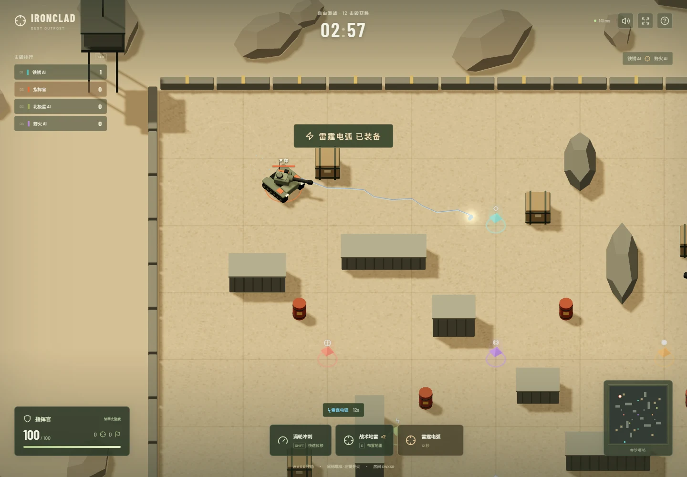
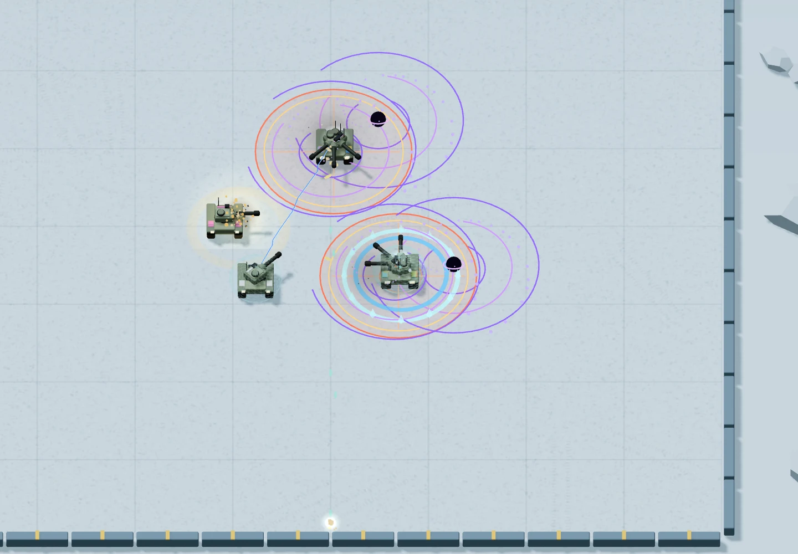

# 进阶武装：先设计，再实现

目标：让交战更有变化，形成「争夺补给 → 制造机会 → 连招击毁 → 反制逃脱」的循环。新增六种道具，总数从 10 增加到 16，保留当前坦克速度和服务端权威判定。

| 道具       | 行为                                               | 反馈与反制                                            |
| ---------- | -------------------------------------------------- | ----------------------------------------------------- |
| 雷霆电弧   | 瞄准方向内放电，最多连锁 3 辆敌车，伤害逐次衰减    | 分叉蓝白电弧；拉开距离或利用掩体隔断连锁              |
| 棱镜弹射炮 | 高速能量弹最多反弹 3 次                            | 青色拖尾、墙面反射火花；避开狭窄走廊                  |
| 奇点引力弹 | 命中或飞行结束后制造短时引力井，牵引并持续伤害敌车 | 紫色旋涡、旋转吸积环；冲刺逃离，护盾抵抗牵引          |
| 蜂群集束弹 | 主弹爆炸后释放 6 枚短程碎片                        | 橙红双层爆炸环与放射弹幕；保持距离，寻找钢墙          |
| 天基轰炸   | 标记瞄准方向的敌人当前位置，预警后落下范围打击     | 地面红金准星、倒计时收束环、垂直光柱；立即移动躲避    |
| 冰霜新星   | 拾取时释放范围冲击，对周围敌人造成伤害和短时减速   | 扩散冰环、冰蓝干扰标记；护盾抵抗，减速状态在 HUD 明示 |

五种新武器持续 12 秒，替换当前火炮；冰霜新星立即生效。开场在地图上安排新武器，玩家出生点附近提供雷霆电弧，避免新功能仅靠随机刷新才能体验。补给恢复间隔缩短到约 8–11 秒，全部 16 种补给进入随机池。

引力井与轰炸标记属于服务端同步的场地效果：最多同时 8 个，每位玩家最多同时维持 2 个。闪电、轰炸与新星采用短生命周期特效；重复几何、材质和粒子需复用，避免重新引入每帧大量绘制和分配。

验证覆盖：连锁次数 / 遮挡、反弹与寿命、集束分裂数量、引力碰撞 / 护盾、轰炸预警与延迟命中、冰霜减速 / 复活清理、全道具随机刷新、联机同步，以及新效果的浏览器渲染与控制台检查。

## 实现与验收

六种新道具已接入全部三张地图、人机与联机模式，军械库优先展示进阶武装。轰炸目标会看到地面标记与撤离提示，冰霜减速显示剩余时间。

- 52 项测试通过：原有规则 / 性能测试，加上 11 项新道具测试及 1 项新道具联机同步测试。
- 5 组浏览器场景通过：桌面操作、双客户端联机、手机操作、拾取并发射雷霆电弧，以及八车进阶特效场景。
- 八车特效场景使用同一模拟引擎，采样时有 6 个场地效果、7 发炮弹，240 次绘制调用，低于测试设定的 500 次预算；未出现 JavaScript 或控制台错误。这是渲染测试场景，不是 8 个网络客户端的吞吐量压测。
- 原始绘制记录：[powerups.json](performance/powerups.json)。
- 构建与类型检查通过；军械库预览见 [arsenal.webp](screenshots/arsenal.webp)。

## 当前补给更新

上述为进阶武装初次交付记录。当前地图增加到 24 处补给：16 处混合站每 5–6 秒随机补充，8 处固定后勤站每 4–5 秒补充。新增徽记、光束、扩散环、附近名称与空站倒计时。新战术规则与验收见 [TACTICS.md](TACTICS.md)。
