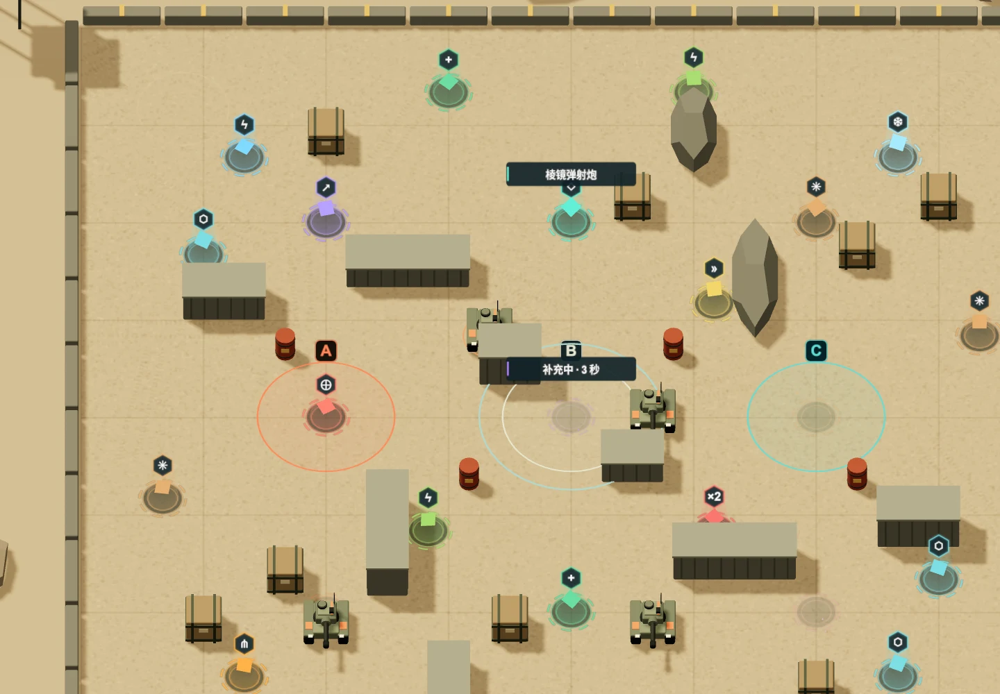
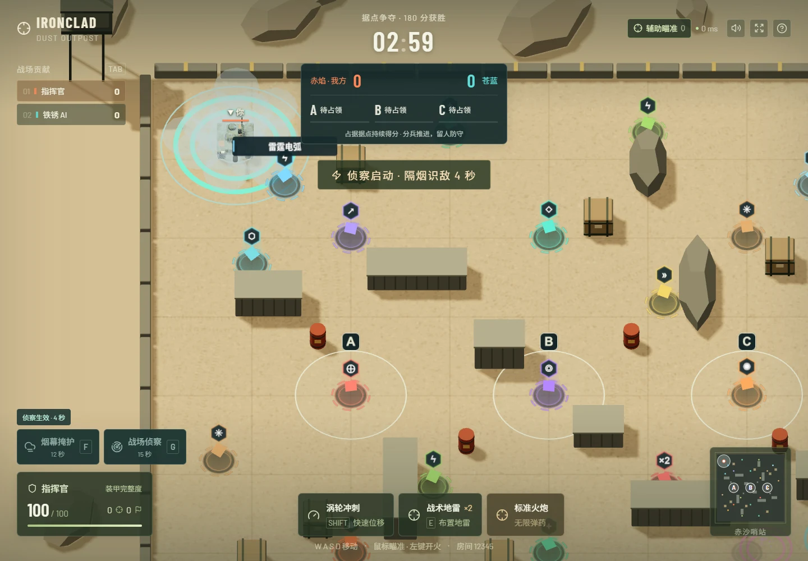

# 据点、侦察与战术补给设计

## 作战循环

默认进入双队据点争夺，保留自由混战选项。玩家先选路线和补给，再占领 A / B / C；队友可分兵夺点、支援争夺点或防守已占据点。电脑遵循同一套规则，优先未占据点并分散目标，低血量时寻找维修。

## 胜负和公平性

- 两队自动平衡，最多各 4 人，同队免疫友军武器、地雷、减速及引力。
- 据点半径 3.4 米，单人 3 秒占领；敌方据点先中立化再占领。多人最高加速至 1.5 倍；双方进入时争夺暂停且停止得分。
- 每个完整占领且未争夺的据点每秒增加 1 分；先达到 180 分获胜，时间到时比较队伍分数，平分为平局。击毁仍记录但不直接决定控点胜负。
- 队伍从地图南北两侧出生；据点与补给的位置公开。

## 主动战术

- F 烟幕：半径 4.5 米，持续 5 秒，冷却 12 秒。阻断隔着烟幕的常规观察和自动锁定，炮弹仍可穿过。
- G 侦察：持续 4 秒，半径 18 米，冷却 15 秒，同队共享侦察；可识别烟幕内敌车。近距 2.5 米及开火后 0.8 秒也会暴露。
- 场景、名字、小地图、辅助瞄准和电脑统一使用烟幕可见性规则。普通区域保持原有视野，减少上手负担。

## 充足且可辨认的补给

- 从 10 处增加到 24 处，地图中心、侧翼和出生路线均有资源。初始覆盖全部 16 种道具。
- 16 处武器/混合补给约 5–6 秒补充；8 处后勤站固定循环维修、护盾、地雷、加速，约 4–5 秒补充。
- 发光核心、带图标的悬浮徽记、垂直光束、地面能量环；附近补给显示名称与用途，空站显示补充倒计时。拾取时产生同色扩散环和粒子反馈。
- 模型使用低面数、实例化粒子和数量上限，不增加实时点光源或全屏后处理。

## 验证

测试占领/争夺/反占、积分胜负、分队及友军免伤、烟幕/侦察、电脑夺点、补给刷新与可达性。浏览器验证模式选择、据点 HUD、F/G、补给外观、触屏布局与渲染预算，并回归房间 12345 和现有操作。

## 实现与验收

- 94 项自动化规则/网络/性能/操作测试与 9 个浏览器场景通过，生产构建和格式检查通过。
- 3 张地图的电脑夺点、24 处补给可达性、后勤刷新、11 种武器友军免伤均有回归覆盖。
- 桌面、390 × 844 竖屏、844 × 390 横屏已经检查。战术按钮与摇杆不重叠，据点标记与补给徽记分开摆放。
- 当前版本本机快速战约 6 秒移动射击采样为 57 FPS；八车/24 处补给/7 个战术区域的渲染夹具为 392 次绘制调用。条件与限制见 [PERFORMANCE.md](../PERFORMANCE.md)。

